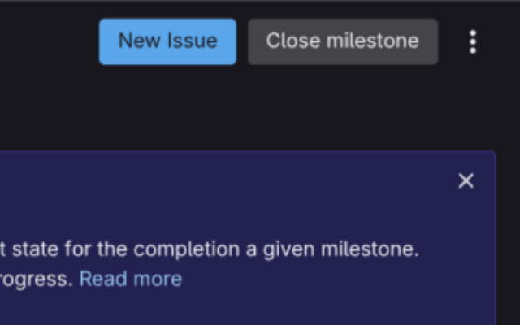

# General

This is a Chromium V3 extension that will add a 'New Issue' button to the milestones page on a Gitlab instance.
Although a button technically already exists, this is easier to use in practice.
The screenshot below shows the button that is created.

# Installation

There are two ways to install this extension.

### Chrome Web Store.

The simplest way is to install it via the Chrome Web Store.
You will need to install the extension called 'Easy Milestone Issue Creator'.

### Manual

You can also manually install this extension.
First clone the repository.
Next go the extensions in your browser and enable 'Developer mode'.
Finally, simply click the 'Load unpacked' button and chose the repository folder.
